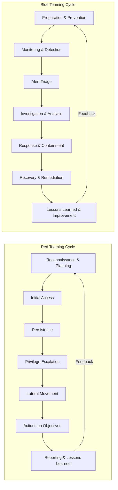

```
       ...                             ..                                                  .....                            ..      s                
   xH88"`~ .x8X                 . uW8"        .x~~"*Weu.                               .H8888888x.  '`+        oe    x .d88"      :8      .uef^"    
 :8888   .f"8888Hf    uL   ..   `t888        d8Nu.  9888c     .u    .                 :888888888888x.  !     .@88     5888R      .88    :d88E       
:8888>  X8L  ^""`   .@88b  @88R  8888   .    88888  98888   .d88B :@8c                8~    `"*88888888" ==*88888     '888R     :888ooo `888E       
X8888  X888h       '"Y888k/"*P   9888.z88N   "***"  9888%  ="8888f8888r               !      .  `f""""      88888      888R   -*8888888  888E .z8k  
88888  !88888.        Y888L      9888  888E       ..@8*"     4888>'88"                 ~:...-` :8L <)88:    88888      888R     8888     888E~?888L 
88888   %88888         8888      9888  888E    ````"8Weu     4888> '                      .   :888:>X88!    88888      888R     8888     888E  888E 
88888 '> `8888>        `888N     9888  888E   ..    ?8888L   4888>                     :~"88x 48888X ^`     88888      888R     8888     888E  888E 
`8888L %  ?888   !  .u./"888&    9888  888E :@88N   '8888N  .d888L .+                 <  :888k'88888X       88888      888R    .8888Lu=  888E  888E 
 `8888  `-*""   /  d888" Y888*" .8888  888" *8888~  '8888F  ^"8888*"                    d8888f '88888X      88888     .888B .  ^%888*    888E  888E 
   "888.      :"   ` "Y   Y"     `%888*%"   '*8"`   9888%      "Y"                     :8888!    ?8888>     88888     ^*888%     'Y"    m888N= 888> 
     `""***~"`                      "`        `~===*%"`                                X888!      8888~  '**%%%%%%**    "%               `Y"   888  
                                                                                       '888       X88f                                        J88"  
                                                                        8888888888888   '%8:     .8*"                                         @%    
                                                                                           ^----~"`                                         :"      


```
               
# cxb3rf1lth

<p align="center" style="margin-bottom: 25px;">
  
</p>

<p align="center">
  
</p>

<!-- Badge Display -->
<p align="center">
  
  
  
  
  
  
</p>

<!--🔥 Animated Snake Activity Graph (GitHub Contribution Snake) -->
<p align="center">
  
</p>

<!--🌐 Visitor Counter -->
<p align="center">
  
</p>

---

**⚡️ _DISCLAIMER: This repository is brand new! Projects will be published and new initiatives will launch within the next few days. If you want to contribute, collaborate, or join the ZedSec and CYB3RF1LTH name, you are welcome—contributors and organization members are encouraged to join the CyberFilth team!_**

**➡️ _DM me on GitHub or email [cxb3rf1lth@protonmail.me](mailto:cxb3rf1lth@protonmail.me) if you're interested in joining or have questions about the team!_**

---

## 🧿 Who Dares Query the Filth?

- 🧠 Self-evolving red team & blue team automaton  
- 🕳️ Offensive security dev, blue team ops, & SOC engineer  
- 🛡️ Detection engineering, adversary emulation, incident response  
- 🕵️‍♀️ Threat hunting, log analysis, C2/implant development  
- 🛠️ Automation, SIEM content, custom lab environments  
- ⚠️ BlackCell architect | ZedSec ops | Autonomous lab cultivator

---

## ⚖️ Balanced Security Focus

**Red Teaming & Blue Teaming/SOC are equally core. Projects, research, and labs empower practitioners on both sides of the cyber spectrum.**

---

## 🟦 Blue Teaming & SOC Projects

- SOC automation scripts & playbooks  
- SIEM rule sets (Splunk, Sentinel, Elastic, etc.)  
- Log parsing, enrichment, and threat detection pipelines  
- Incident response frameworks and tools  
- Threat hunting and alert triage labs  
- Detection engineering for real-world adversary techniques  
- Custom dashboards, reports, and SOC workflow enhancements  
- **Custom ZedSec/cxb3rf1lth SOC setups for:**  
  - EDR (Endpoint Detection & Response) integration  
  - Threat Intelligence (TI) pipelines  
  - IDS (Intrusion Detection Systems) architectures  
  - SIEM (Security Information and Event Management) deployments & content

---

## 🔴 Red Teaming & Offensive Security

- C2 frameworks and implants  
- Evasion tooling and red team tradecraft  
- Malware loaders and custom payload generators  
- Adversary simulation and attack automation  
- Exploit development and vulnerability research

---

## 📚 Libraries & Resources

- Curated books on cybersecurity, blue teaming, SOC ops, and offensive security  
- Collections of links to tools, blogs, and research papers  
- Learning paths and guides for SOC analysts and red teamers  
- Reference material for detection, response, and attack capabilities

---

## 💻 Terminal Interface Preview

```sh
┌──(cyb3rf1lth㉿zedsec)-[~/SOC-lab]
└─$ ./start-threat-hunt.sh --mode real-time
[+] Gathering logs...
[+] Parsing events...
[+] Correlating threat intel...
[+] Detections deployed! SOC ready.
```

---

## 🗺️ Red Team & Blue Team Cycles (Mermaid Dual Attack/Defense Chains)



---

## 🧪 Labs, Guides, and Write-Ups

- Blue and red team lab environments  
- SOC operational guides and runbooks  
- Adversary emulation plans  
- Detection rule repositories  
- Research, case studies, and technical write-ups

---

## 🏴‍☠️ Get Filthy

Check the pinned projects, browse the repo, and join the ongoing evolution of offensive and defensive security.

---

> _Paste this directly into your README.md for an instant upgrade!_  
> _All effects and visuals work on GitHub.com out of the box—no setup required._
